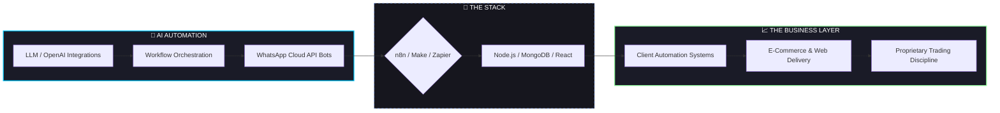

 

---

## 🧬 Identity Core

<table width="100%">
<tr>
<td width="55%" valign="top">

**Location:** Karachi, Pakistan 🇵🇰
**Focus:** AI Automation · Full-Stack Web Development · Proprietary Trading · Robotics
**Currently Building:** [GuideXTech](#) — an AI automation agency helping manual businesses go automated

### 🎓 Education

| Program | Institution | Duration |
|---|---|---|
| BS Robotics & Intelligent Systems | Bahria University, Karachi | 2024 – 2028 |
| Diploma, Computer Programming | Aptech Pakistan | 2022 – 2023 |
| Intermediate (Pre-Engineering) | Govt. Dehli College, Karachi | 2021 – 2023 |

### 🏆 Certifications

- 🎓 **Diploma in Web Development** — Aptech Computer Education, Karachi (2021–2022)

</td>
<td width="45%" valign="top">

</td>
</tr>
</table>

---

## 🧠 Professional Profile

I build practical AI-automation and web solutions, actively trade financial markets, and study robotics and intelligent systems — with a strong focus on real-world application.

What makes my work distinctive is the ability to combine **agentic AI systems** (LLM orchestration, WhatsApp-based chatbots, workflow automation) with **hands-on web & e-commerce execution** and a **disciplined, markets-driven mindset** from proprietary trading. I care about turning manual, repetitive business workflows into automated systems that actually save people time.

> 💡 Currently focused on helping small-to-medium businesses — restaurants first — automate customer conversations, bookings, and operations using AI.

### ⚙️ Operating Principles

<table width="100%">
<tr>
<td width="50%">

**How I Build**
- Automation over repetitive manual work
- Practical, revenue-driving solutions over hype
- Clean, modular, API-first architecture
- User-focused design & clear communication
- Consistency, self-learning & disciplined execution

</td>
<td width="50%">

**How I Think**
- Systems thinking over one-off scripts
- Data-informed decisions (trading discipline applied to business)
- Ship fast, iterate faster
- Client relationships built on clarity & trust
- Growth through reflection and real-world feedback

</td>
</tr>
</table>

---

## ⚡ What I Do: AI, Web & Markets

---

## 🛠️ Technical War Chest

### Languages

### AI & Automation

### Backend & Data

### Frontend & CMS / E-Commerce

### Digital Marketing & Design

### Robotics & Embedded Systems

---

## 🚀 Selected Project Portfolio

### 🤖 AI Automation & Business Systems

| Project | Domain | Stack | Description |
|---|---|---|---|
| **GuideXTech Automation Suite** | AI Automation Agency | OpenAI, n8n, WhatsApp Cloud API, Node.js, MongoDB | End-to-end AI automation systems turning manual business workflows (bookings, support, orders) into automated flows |
| **WhatsApp AI Chatbots** | Conversational AI | WhatsApp Cloud API, LLM Integrations, n8n/Make | Custom chatbots handling customer queries, orders & bookings for restaurants and SMBs |
| **Custom Business Integrations** | Workflow Automation | Zapier, Make, REST APIs | Connecting CRMs, POS systems & communication tools into a single automated pipeline |

### 🦾 Robotics & Embedded Systems

| Project | Domain | Stack | Description |
|---|---|---|---|
| **Smart Home Automation** | IoT / Embedded | ESP32, Sinric Pro, Google Assistant | Voice-controlled system for multiple appliances with manual override |
| **Sumo Robot** | Competitive Robotics | ESP32, C++, IR/Ultrasonic Sensors | Autonomous sumo-strategy robot with ~90% detection accuracy; custom chassis in SolidWorks |
| **Line-Following Robot** | Autonomous Robotics | Arduino, PID Control | Real-time calibrated PID control for accurate line tracking |

### 🌐 Web Development & E-Commerce

| Project | Domain | Stack | Description |
|---|---|---|---|
| **Ecommerce Store** | Shopify Development | Shopify, Secure Payments | Fully functional store with responsive, conversion-focused design |
| **Blog Website** | Content / SEO | WordPress | SEO-optimized blog with custom UI and social features |
| **Client Websites** | Freelance Web Dev | WordPress, Shopify, HTML/CSS/JS, PHP, MySQL | Responsive websites and online stores built for personal & client projects since 2022 |

---

## 💼 Experience & Roles

<table width="100%">
<tr>
<td width="50%" valign="top">

**🚀 Co-Founder — GuideXTech**
*November 2025 – Present*
- Building an AI automation agency turning manual businesses into automated ones
- Delivering AI automation, WhatsApp chatbots, web development & custom integrations
- Targeting SMBs with repetitive workflows, starting with restaurants

**📈 Proprietary Trader — FundingPips**
*August 2025 – Present · Dubai, UAE*
- Actively trading financial markets with disciplined, data-informed execution

</td>
<td width="50%" valign="top">

**💻 Freelance Web Developer & Digital Marketer**
*August 2022 – Present · Karachi, Pakistan*
- Built and maintained WordPress & Shopify websites for personal and client projects
- Launched and ran e-commerce stores — sourcing, marketing & support
- Executed Meta Ads campaigns, increasing traffic and conversions
- Created SEO-optimized content and landing pages

**📢 Social Media Marketing Manager & Ecommerce Owner — WitacoMart**
*Nov 2023 – Apr 2024*

**✍️ Blogger — Read Upto Infinite**
*Apr 2023 – Mar 2024*

</td>
</tr>
</table>

---

## 🌍 Technical Domains

### 🤖 Agentic AI & Automation
`LLM Integrations` • `Workflow Orchestration` • `WhatsApp Chatbots` • `n8n / Make / Zapier`

### 🌐 Web & E-Commerce
`Full-Stack Development` • `WordPress` • `Shopify` • `Responsive Design` • `SEO & Meta Ads`

### 🦾 Robotics Engineering
`Embedded Systems` • `ESP32 / Arduino` • `PID Control` • `Sensor Integration` • `SolidWorks CAD`

### 📈 Markets
`Proprietary Trading` • `Risk Management` • `Disciplined Execution`

---

## 📈 Activity & Contribution Graph

---

 

### 📡 Let's Connect

 

*"Automate the manual. Trade the disciplined. Build the impact."*

 

