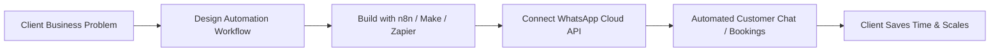
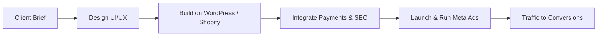
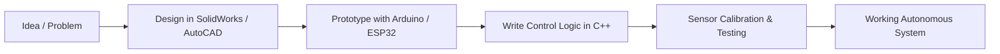

 

## 👤 About Me

- 📍 Based in Karachi, Pakistan
- 🚀 Co-Founder at **GuideXTech**, an AI automation agency turning manual businesses into automated ones
- 📈 Proprietary Trader at **FundingPips**, Dubai
- 💻 Freelance web developer & digital marketer since 2022
- 🎓 BS Robotics & Intelligent Systems, Bahria University (2024–2028)
- 🦾 Build hardware too — robots, embedded systems, and automation projects on the side

---

## ⚡ What I Do

**1. AI Automation for Businesses**

**2. Web Development & E-Commerce**

**3. Robotics & Embedded Systems**

---

## 🛠️ Tech Stack

**Languages**

**Automation & Backend**

**Web & E-Commerce**

**Robotics & Hardware**

---

## 🚀 Projects

**AI Automation**
| Project | Stack |
|---|---|
| GuideXTech Automation Suite | n8n, WhatsApp Cloud API, Node.js, MongoDB |
| WhatsApp AI Chatbots | WhatsApp Cloud API, n8n / Make |
| Custom Business Integrations | Zapier, Make, REST APIs |

**Web & E-Commerce**
| Project | Stack |
|---|---|
| Shopify E-Commerce Store | Shopify, secure payments |
| SEO Blog Website | WordPress |
| Client Websites | WordPress, Shopify, HTML/CSS/JS, PHP |

**Robotics & Embedded Systems**
| Project | Stack |
|---|---|
| 6 DOF Robotic Arm | Arduino, servo control |
| Gimbal Robot | ESP32, motor stabilization |
| Home Security Alarm | Arduino, sensors |
| Sumo Robot | ESP32, C++, IR/ultrasonic sensors |
| Soccer Bot | Arduino, sensor integration |
| Obstacle Avoidance Robot | Arduino, ultrasonic sensors |
| Line-Following Robot | Arduino, PID control |
| Clap Switch | Arduino, sound sensor |
| Smart Home Automation | ESP32, Sinric Pro, Google Assistant |

---

## 💼 Experience

- **Co-Founder, GuideXTech** — *Nov 2025–Present, Pakistan* — Building an AI automation agency; delivering automated WhatsApp systems, workflows, and integrations for SMBs, starting with restaurants.
- **Proprietary Trader, FundingPips** — *Aug 2025–Present, Dubai* — Trading financial markets with disciplined, rules-based execution.
- **Freelance Web Developer & Digital Marketer** — *Aug 2022–Present, Karachi* — Building WordPress/Shopify sites, running Meta Ads and SEO campaigns, and managing client e-commerce stores.
- **Social Media Marketing Manager & E-Commerce Owner, WitacoMart** — *Nov 2023–Apr 2024* — Managed store operations and social marketing.
- **Blogger, Read Upto Infinite** — *Apr 2023–Mar 2024* — Wrote and published content for a US-based blog.

---

  

